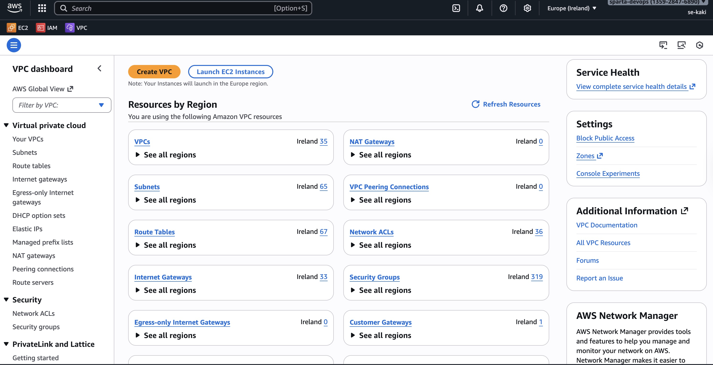
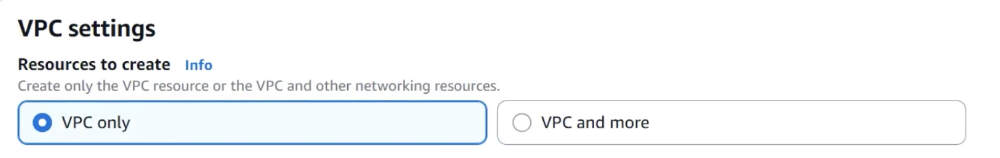
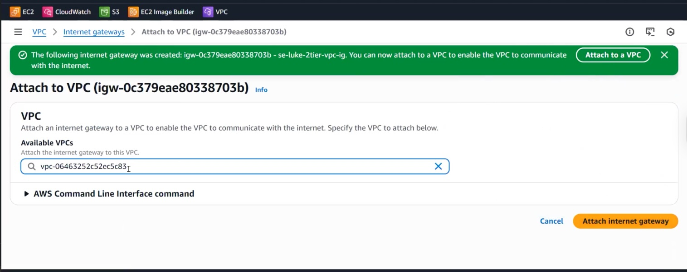
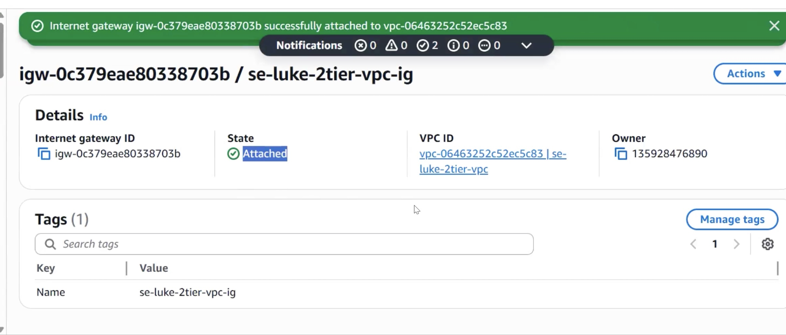

## Create VPC
A VPC is an isolated portion of the AWS Cloud populated by AWS objects, such as Amazon EC2 instances


AWS setting


    1. VPC only

    2.Name tag 
    
-  se-kaki-2tier-vpc
- IPv4 CIDR blockk
- Ipv4 CIDR
- no IPV6 CIDR block

        10.0.0.0/16
    
- **Tenancy** -> Default
- **Tag** -> default
    

    **VPC Shell is created!!**

## Next - create 2 subnets, Public and Private
Select the VPC that has just created


 Subnet settings - we can create many subnets in one time (both public and private for this demo case)

    Specify the CIDR blocks and Availability Zone for the subnet
- IPv4 VPC CIDR block for Public

```        
10.0.2.0/24
```
- AZ euw1-az1(eu-west-1a)


- IPv4 VPC CIDR block for Private
        
        10.0.3.0/24
- AZ euw1-az1(eu-west-1b)


Both Public and Private subnets are created and shown on console


## Create an Internet gateway

- Internet gateway is used for connect internet in and out to the VPC


    Attach the Internet Gateway to a VPC


    Attached



## Create RouteTable
- To facilitate the flow of traffic

Public Route Table setting


Go to the **Subnet associations** Tab

Press the Edit subnet associations button


Press edit Route button


Go back to the console and check the VPC shell


