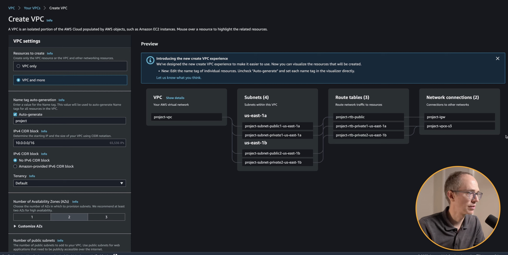

In a new markdown file, cover the following:

# VPCs
 ## What are **VPCs**?
    
A **Virtual Private Cloud (VPC)** is a secure, isolated, and customisable private network inside AWS. 

It allows you to design your own networking environment, including:
- the **IP address range** (CIDR block)
- the **subnets** within the network
- how **traffic flows** between components
- which resources are **public** or **private**
- the **security rules** that protect the network (Security Groups & NACLs)

A VPC is essentially **your own private section of the cloud**, where you control the architecture and security.

##  Why use/create/customise them?
        
    We create custom VPCs to gain security, control, and proper cloud architecture:
- **Stronger security**  
  - isolate databases in private subnets  
  - restrict inbound/outbound traffic  
  - prevent public exposure  
- **Full control over networking**  
  - choose IP ranges  
  - create public/private subnets  
  - control internet access via IGW/NAT  
- **Scalable, production-ready architecture**  
  - multi-AZ setup  
  - separate tiers (web/app/db)  
- **Compliance and best practices**  
  - follows industry standards  
  - suits real-world cloud deployments  

Default VPCs are okay for beginners—but **real systems require custom VPCs**.

        Default VPC = AWS decides.
        Custom VPC = you decide.
    

## What would a default VPC looklike?

    A default VPC is automatically created by AWS for convenience.  
It usually includes:

- one large CIDR block (e.g., **10.0.0.0/16**)
- multiple **public subnets** (one per AZ)
- an **Internet Gateway** already attached
- a **main route table** routing all traffic to the IGW
- a basic **Security Group**
- DNS support enabled by default

Characteristics:

- everything is **public by default**  
- quick to use  
- **not suitable for production**  
- limited control

**Create a new VPC**

- What are the core components?

        A VPC is made up of several networking components that work together to create a **secure** and **controllable** cloud environment. The key components are:
    - **VPC** (the overall private network)
- **CIDR Block** (IP address range)
- **Subnets**  
  - public subnets  
  - private subnets  
- **Internet Gateway (IGW)**
- **NAT Gateway**
- **Route Tables**
- **Security Groups**
- **Network ACLs (NACLs)**
- **Availability Zones (AZs)**


# IP addresses:

## Public vs Private IP addresses

🔹 Public IP Address

    🧑‍💻A public IP is an address that is reachable on the internet.

- Globally unique

- Assigned by ISPs or cloud providers

- Required for internet-facing resources

- Used by load balancers, NAT gateways, public EC2 instances, websites, DNS servers

Example:
8.8.8.8 (Google DNS)

Use case:
A web server that needs to be accessible across the internet.

---

🔹 Private IP Address

    🔐 A private IP is an address used inside a private network, such as your home WiFi or an AWS VPC.

 - Not reachable from the public internet

- Can be reused across different networks

 - Safer for internal communication

 - Used for databases, backend services, internal EC2 instances, containers

    **Private IP ranges:**

        10.0.0.0 – 10.255.255.255

        172.16.0.0 – 172.31.255.255

        192.168.0.0 – 192.168.255.255

Example:
10.0.1.12
192.168.0.1

Use case:
A database inside a private subnet communicating only with backend services.

---

## IPv4 vs IPv6

🔹 IPv4

    The original and most widely-used version of the Internet Protocol.

    Format:
    x.x.x.x (4 numbers between 0–255)

    Size:
    32-bit total → ~4.3 billion possible addresses

    Example:
    192.168.1.10
    54.23.180.55


**Pros:**

 - Simple

  - Compatible everywhere

   - Easy to manage

   - Used by the majority of cloud setups (including most AWS VPCs)

**Cons:**

 - Running out of addresses globally

 - Needs NAT to handle scaling

--- 
 🔹 IPv6

    The next-generation protocol designed to solve IPv4 exhaustion.

    Format:
    2001:0db8:85a3:0000:0000:8a2e:0370:7334

    Size:
    128-bit total → almost infinite addresses

👍🏻**Pros:**

- Huge address space

- No need for NAT

- Faster routing in some cases

- Designed for modern internet scale (IoT, cloud, etc.)

👎🏻**Cons:**

- Not fully adopted everywhere

- More complex address format

- Many systems still rely on IPv4

```
🧑‍💻 Public IP = reachable on the internet
🔐 Private IP = internal-only, not internet accessible

🛜IPv4 = older, 32-bit, widely used
☁️IPv6 = newer, 128-bit, huge address space
```


## CIDR Blocks

A **CIDR block** defines how many bits of an IP address belong to the **network** portion.  
The remaining bits are used for **hosts** (EC2 instances, containers, load balancers, etc.).

- The **larger** the CIDR number → the **smaller** the subnet.  
- The **smaller** the CIDR number → the **bigger** the network.

Examples:
- **/8** → very large network  
- **/16** → common size for VPCs  
- **/24** → common size for subnets

```
[8 bits].[8 bits].[8 bits].[8 bits] = 32 bits
10.0.0.0/24
10.0.0.0/16
10.0.0.0/8
/24 last number 10.0.0.1 - 10.0.0.254
/16 last two numbers 10.0.0.1 - 10.0.255.254
/8 last  three numbers 10.0.0.1 - 10.255.255.254

 https://www.youtube.com/watch?v=2doSoMN2xvI&t=127s

```
## Subnet masks
    A **subnet mask** defines which part of an IP address is the **network** portion and which part is the **host** portion.

- Works together with CIDR notation  
- Converts the CIDR (e.g., /24) into a binary mask  

Common examples:

| CIDR | Subnet Mask         | Meaning                          |
|------|----------------------|----------------------------------|
| /8   | 255.0.0.0            | Very large network               |
| /16  | 255.255.0.0          | Typical VPC size                 |
| /24  | 255.255.255.0        | Typical subnet size              |

A subnet mask of **/24** means:
- First 24 bits = network  
- Last 8 bits = host  

This is how AWS knows which IPs belong inside the same subnet.
## Reserved IP Ranges

There are two types of reserved IP ranges:

### 1. Private IP ranges (RFC1918)
These ranges are used inside private networks like VPCs, offices, and home WiFi:

- 10.0.0.0 – 10.255.255.255
- 172.16.0.0 – 172.31.255.255
- 192.168.0.0 – 192.168.255.255

They **cannot be reached from the internet** and are safe for internal communication.

---

### 2. Reserved IPs inside each AWS subnet
AWS also reserves **5 IP addresses** inside every subnet:

- Network address (first IP)
- AWS VPC router
- Reserved for AWS
- Reserved for AWS
- Broadcast address (last IP)

This means the usable range is always “**between**” the first and last IP.


## What is NAT?

**NAT (Network Address Translation)** allows resources in **private subnets** to access the internet **outbound**, while preventing the internet from initiating connections **inbound**.

Private subnets do not have public IP addresses, so they cannot reach the internet directly.  
A NAT device solves this by acting as a bridge.

---

### Why NAT is needed

Private EC2 instances often need to:

- download software updates
- access external APIs
- connect to package repositories (npm, apt, yum)
- send telemetry or logs

But they must remain **unreachable** from the public internet for security.  
NAT enables this exact behaviour.

---

### NAT Gateway (AWS)

In AWS, the most common NAT solution is the **NAT Gateway**.

Key characteristics:

- Deployed in a **public subnet**
- Has a **public IP**
- Receives outbound traffic from private subnets
- Sends traffic to the internet on their behalf
- Returns responses back to the private instances
- The internet **cannot** initiate traffic through a NAT gateway

---

### How it works (simple flow)


## Subnets:
- Public and Private subnets
- How do AZs relate to subnets?

## Gateways:
- NAT Gateways vs Internet Gateways
- How do public subnets access the internet?
- Why do private subnets need NAT?
- Are there cost differences?
- Different architectures?

## Route Tables:
- What does a "default" route table look like?
- Local routing
- 0.0.0.0/0 routing
- Routes to NAT gateway vs internet gateway
- How do RT association work?

## SGs and NACLs:
- What are ports?
- Inbound vs Outbound rules
- Stateful vs stateless
- SG referencing
- Common SG architectures

## Bonus:
- DNS
- Route53
- Different VPC designs

## Reminders:
- Use images
- Make/link diagrams where possible
- Keep things fairly concise
- Guide should be usable by others
- Be ready to present your work tomorrow